This Project will show step by step guideline to create AKS using Terraform and AzuredevOps. Then it will create another CI/CD pipeline to push docker and apply K8s mainfests

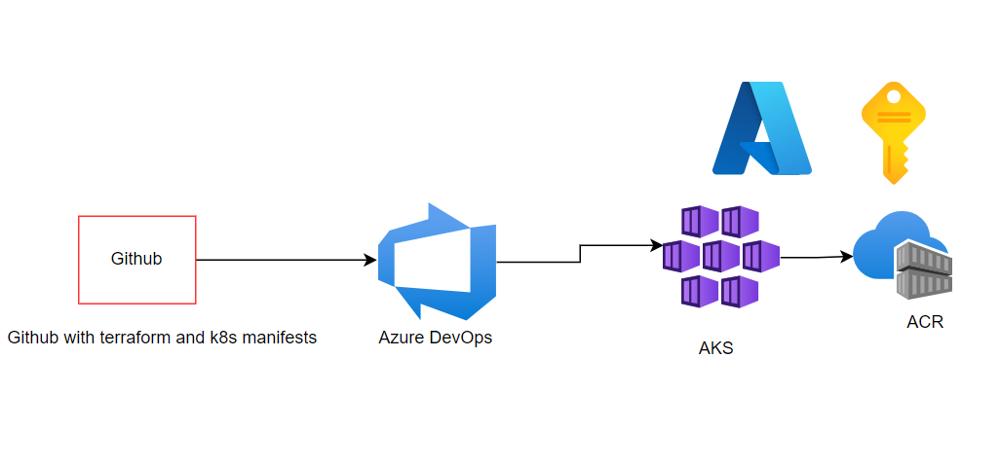

Pre-requisites:
1. Azure Subscription
2. Azure DevOps Organsation
3. Github account
4. Vscode

**********************************************************************

For Backend:

Create storage account, container and key

************************************************************************

Create Azure DevOps organisation:
login to azuredevops

Go to organanization settings
From Extenstion- go to marketplace and download terraform task installer as per below

Now Create a Project:

Go to your projects settings-service connection
Create Service Connection
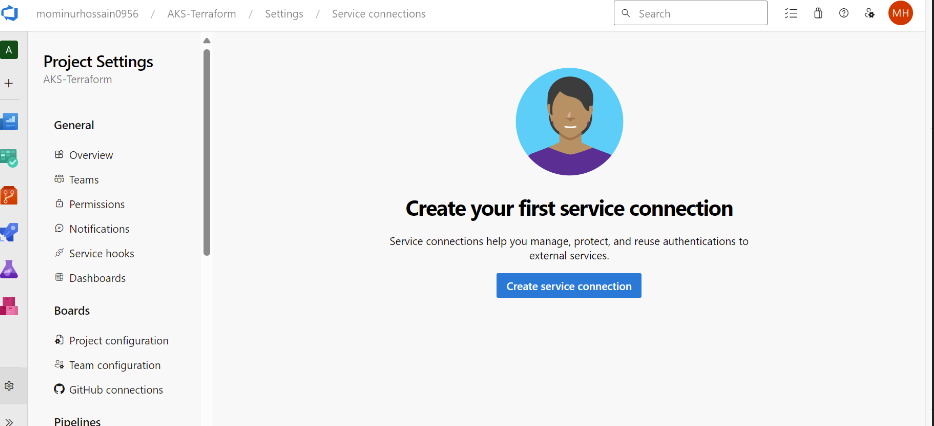

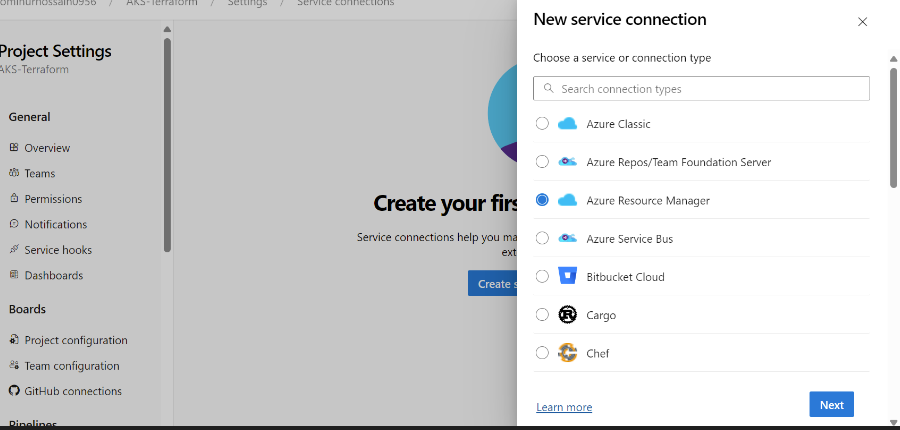

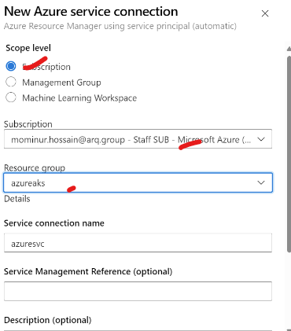

If you have followed the steps above you will see like below
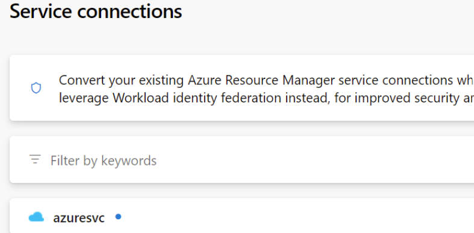

Now, from your service connection click on manage app registration. It wil take you to the following page

get the client id and assign the roll as per below:
az role assignment create --assignee client id --role "User Access Administrator" --scope /subscriptions/subscription id

Create another service connection to integrate your github. 

In the project go to Library and set your common variables:
Create a variable group and set below variables:
backendAzureRmContainerName
aks
backendAzureRmKey
aks.tfstate
backendAzureRmResourceGroupName
azureaks
backendAzureRmStorageAccountName
aks1245
backendServiceArm (your service connection name)
azuresvc
backendType
azurerm
environmentServiceName
azuresvc (your service connection name)

Please see the screenshot below

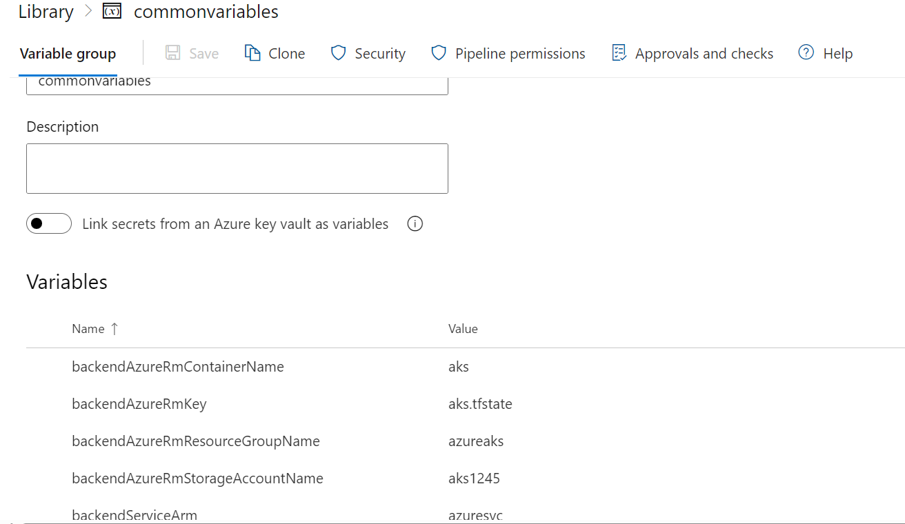

CREATE YOUR FIRST PIPELINE:

You will be asked to show your code
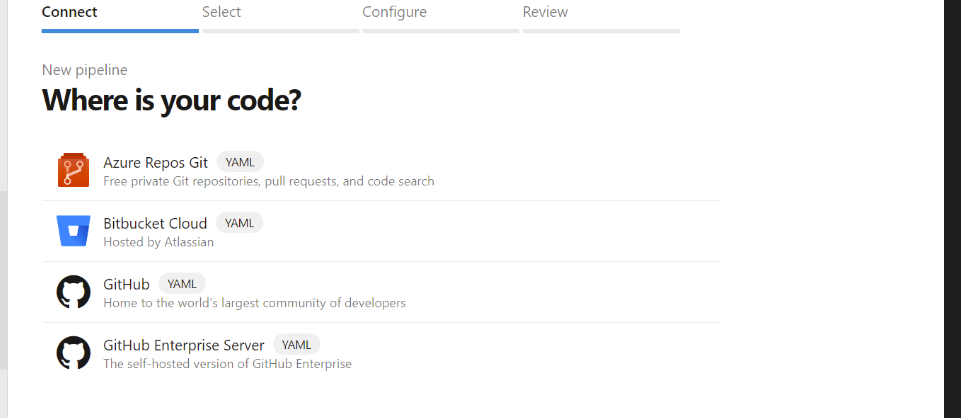

Select existing azure pipeline here:
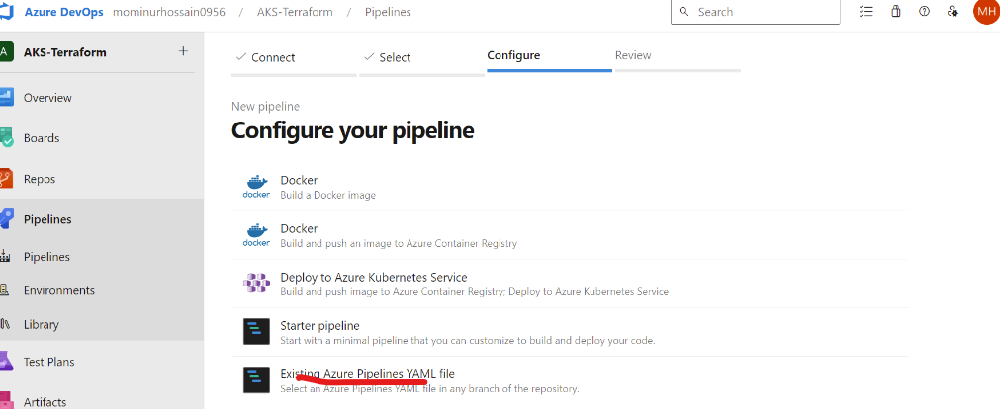

Show your pipleline as below:
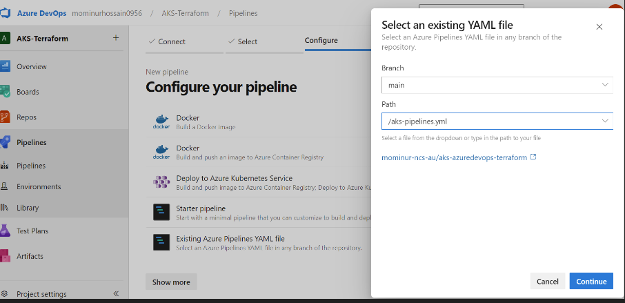

Save and run. 

Before this piplline run:
go to your vs code: update your tfvars file, set your acr name something unique and push your code to github

Then configure the previous pipeline step and save and run

This should Create the cluster.

******************************************************************
CI/CD with Docker and kuberenetes manifest

Step 1. Create a docker service connection

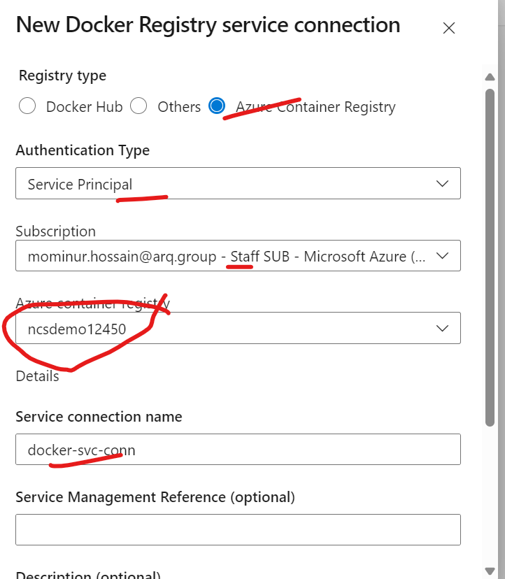

Grant access to all pipelines and save

Step 2.
Update docker-K8s-pipelines.yml-provide your service connection name
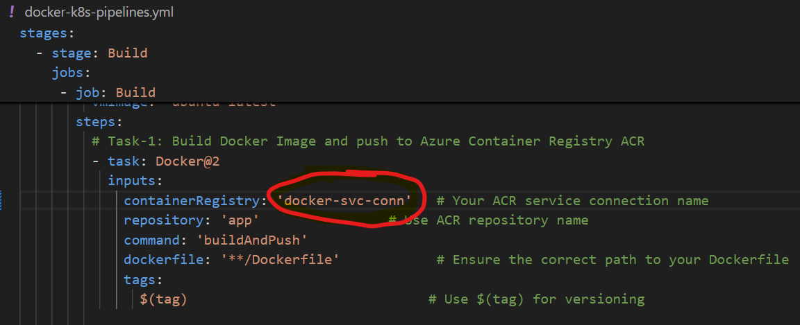

Step 3. 
Push the code

Step 4. Create a new pipeline (Follow previous steps on how to create use docker-k8s-pipelines.yml)
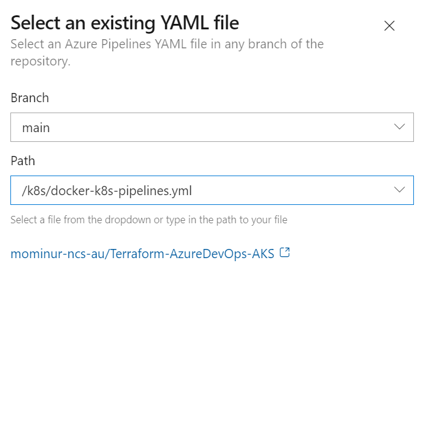

I saved it as application pipeline
and run is successful

You can see your image is published to container repository
********************************************************************************
Above we have created CI for application. Now we will create a CD (Release) with continuous deployment trigger enabled. 

Before that, Let's create one more service connection for Kubernetes.
Step 1:

Grant access to all pipelines and save

Step 2:
1. Go to Azure Pipeline and create a release
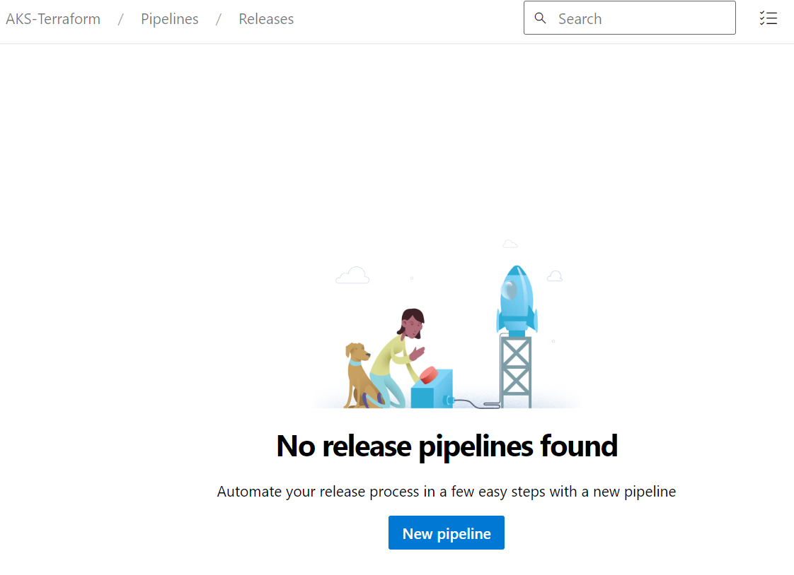

Click on create new pipeline

select "deploy to Kubernetes template

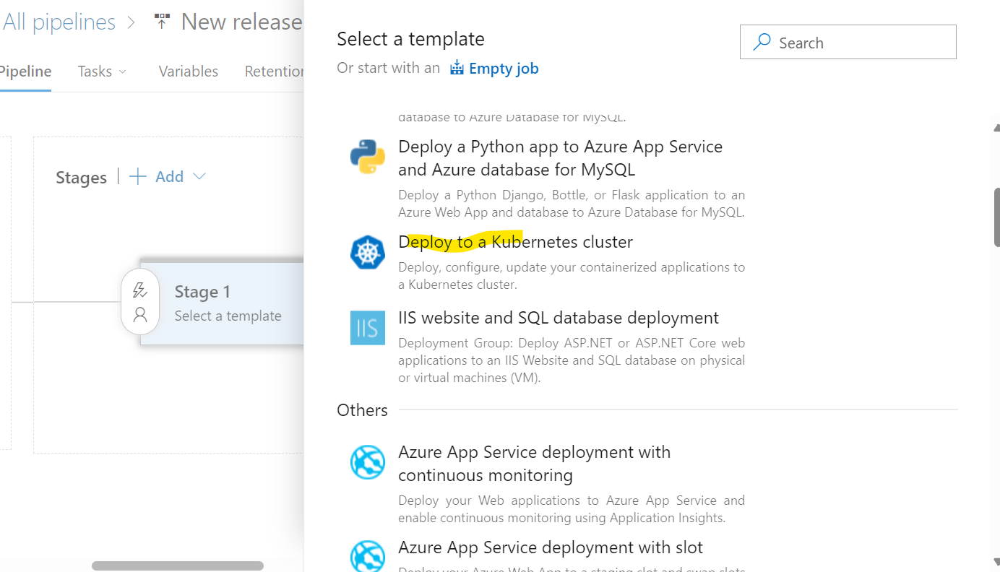

Change stage name to dev

2. Click on Artifact and select your application pipeline as the source and click 'add'
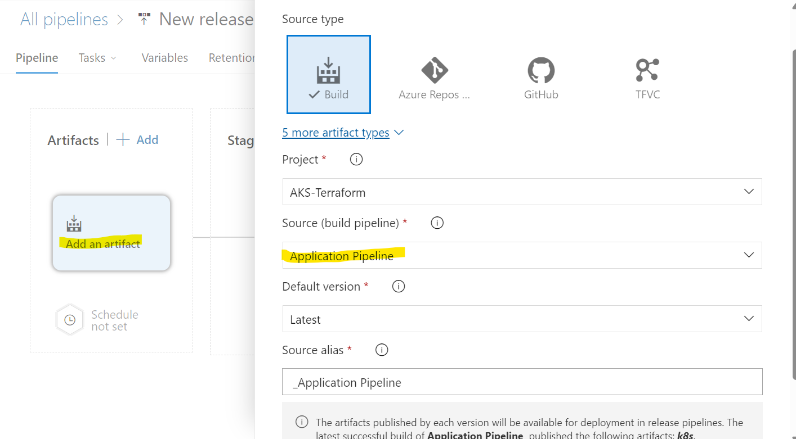

3. You can save. You can also name the pipeline as KUbernetes deploy 

4. Click on job and then on the agent job. Select agent job specification as per below
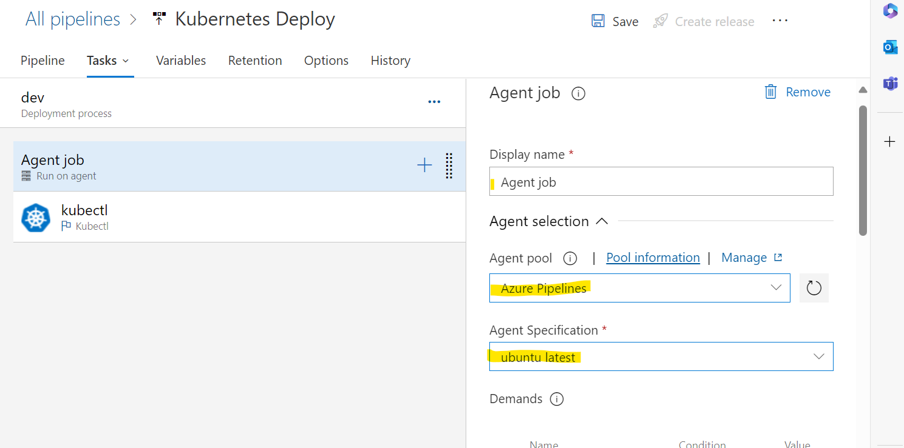

Right click on Kubectl job and remove that job. Now, click the right hand plus on the agent job and add a task to the agent job

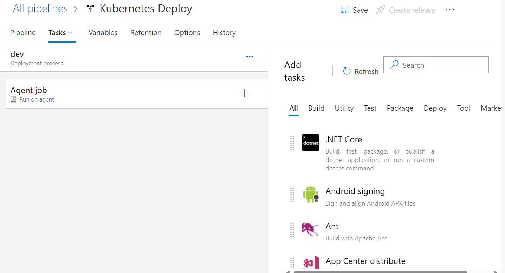
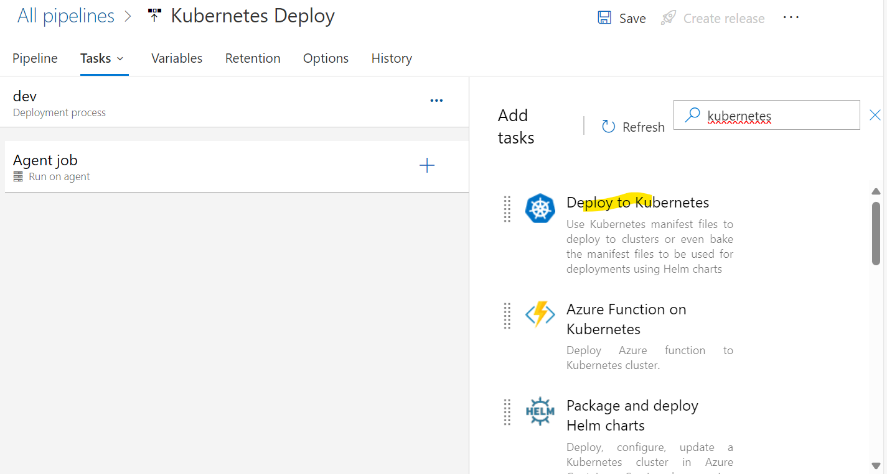

add deploy to Kubernetes job. Click on deploy and configure as per below
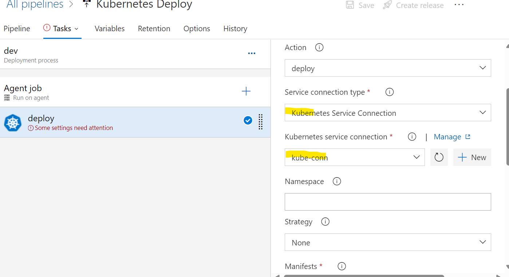

Select your mainfest as per below
![alt text](image-34.png
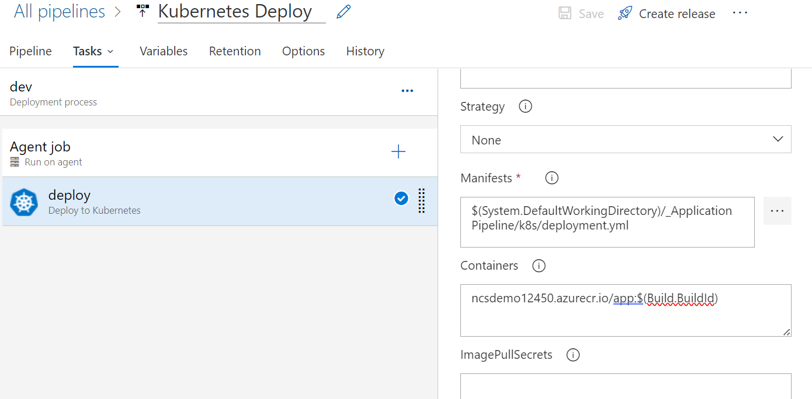

Finally enable continuous deployment trigger
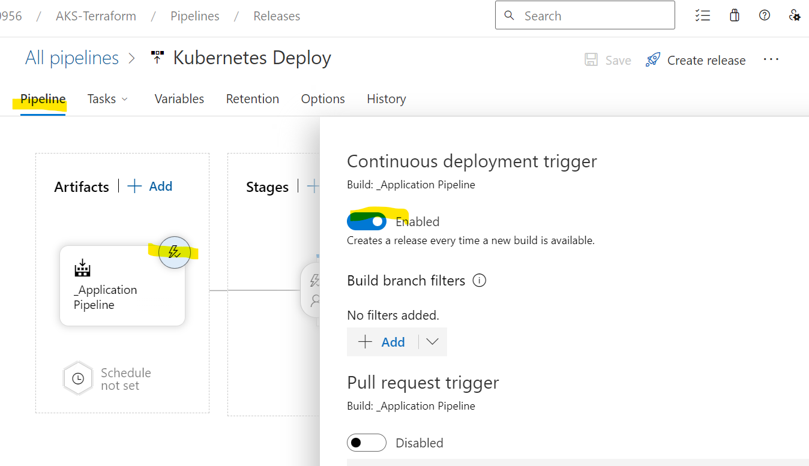

